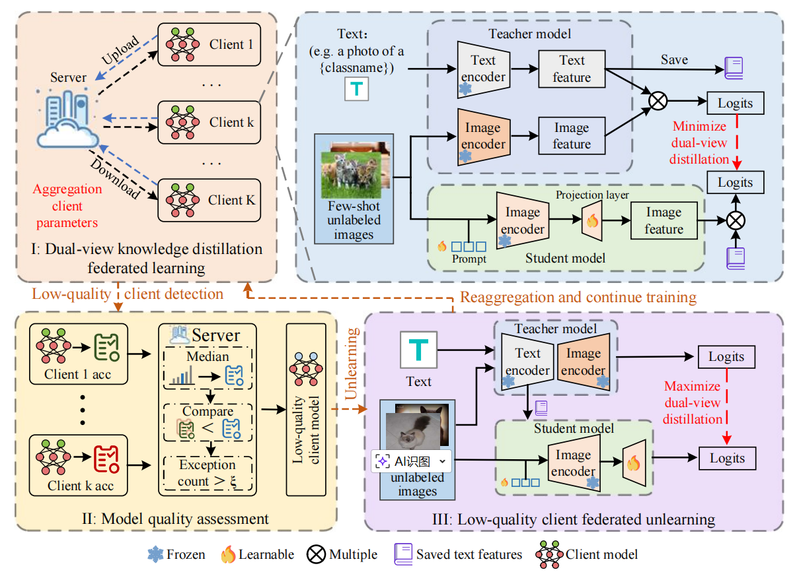

# Federated Vision-Language Unlearning with Dual-view Knowledge Distillation
## Architecture diagram：


## Running：

### 1、requirement install：

```
pip install -r requirements.txt
```
The requirements.txt file is already included in the project root directory, so you can install the environment by running the command directly.

### 2、Teacher model generation：

```
bash scripts/promptsrc/different_numshot_train.sh oxford_pets 1
```
（1）The configuration file for different_numshot_train is included in the config folder. You can modify hyperparameters there, such as the learning strategy, learning rate, and teacher model.

（2）Run this command in the project root directory to obtain the teacher model model.pth.tar-20.


### 3、run script：

```
CUDA_VISIBLE_DEVICES=0 scripts/federated-promptkd/fed_train_only.sh oxford_pets 1  
```

1、First, load the path to the teacher model model.pth.tar-20 into promptKD.py:
```
if cfg.TRAINER.MODAL == "base2novel":
    model_path = "teacher_model/Oxford_pets/VLPromptLearner/model.pth.tar-20"
```
2、The configuration file for fed_train_only is included in the config folder. You can modify hyperparameters there, such as the number of clients and the optimizer.
